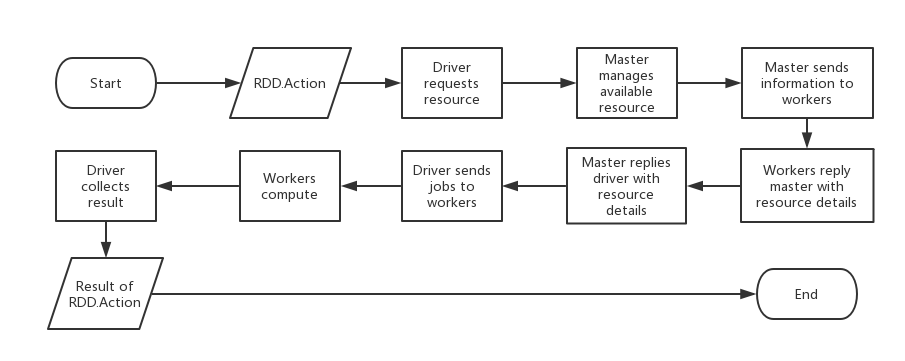

# simSpark
a simple mini Spark project

## History

| Event                                                        | Date             |
| ------------------------------------------------------------ | ---------------- |
| Initialization                                               | 2018 Dec.18, Tue |
| Delete `driver`, add `worker` and `client` to basic structrue | 2018 Dec.18, Tue |
| Master and driver simple implementation                      | 2019 Mon.8, Mon  |

## Contributors

Yuhua **Wei**, Tao **Yi**

*ordered by family name*

## Structure of directory

- simSpark
  - publib

    This directory consists of global modules of `simSpark`.

  - master

    This directory consists of the listener deployed at Master node of a `simSpark` cluster and the particular modules it needs.

  - worker

    This directory consists of the listener deployed at Workder node of a `simSpark` cluster and the particular modules it needs.

  - driver

    This directory consists of the library for user-defined simSpark program. Users can import the library to create a `simSpark` context and  get facilities for RDD calculation

## Project Target

The project is meant to implement a `simSpark` system which can finish some simple distributed computation tasks. As an example, we will finish a simple `map` and `reduce` task: given a array contains some integers, denoted as $[a_0, a_1, ..., a_n]$, calculate the sum of the array.

## Implementation Details

### Environment

| Language   | Developing System         | Runtime System |
| ---------- | ------------------------- | -------------- |
| Python 3.5 | Ubuntu 18.04 / Windows 10 | Ubuntu 16.04   |

All official and third-party library used:

`sys`,`time`,`json`,`threading`,`logging`,`datetime`
os
inspect
binascii
functools
signal
fcntl
subprocess
pickle

### Master Node

The master of `simSpark` works as a daemon in a node of the cluster. The node is called `master node`. A master should be able to manage the resource of the cluster and help the communication between workers and applications.

To implement a master node, a main loop which is meant to receive and respond to message and a means of daemonizing a program is needed.

Thus, three modules are designed and implemented.

- `simSpark_master.py`
- `master_body.py`
- `master_configuration.py`

Also, a global module `SparkConn.py` is also implemented for connection.

#### simSpark_master.py

`simSpark_master.py` is a module which can demonize the functional part of master. The module is written under the standards of daemon in Linux.

##### Usage

| start                               | stop                              | restart                              |
| ----------------------------------- | --------------------------------- | ------------------------------------ |
| `$ python simSpark_master.py start` | `$python simSpark_master.py stop` | `$python simSpark_master.py restart` |

#### master_body.py

`master_body.py` is the functional part of master node modules. After daemonized by `simSpark_master.py`, this module run as a daemon, maintaining a main loop.

On create, it set up a timer that send a message which informs of itself to check the status of workers. Then it listens to a certain port, waiting the messages which come from applications(drivers) and workers.

It manages the status of workers and the resource request pended by applications.

##### Workers management

The master periodically check the workers which are registered. If the latest heartbeat of a worker is too early ago, it is considered not alive. If for several rounds a worker behaves like this, it will be killed.

##### Resource management

After a resource request is received, the master will check all alive workers and insert them into an empty min-heap according to busy executors they own. For every executor an application needs, master picks the top of the heap ,assign one of its idle executor to the application and update the heap.

#### master_configuration.py

`master_configuration.py` is the module that helps user to modify the configuration of master, affecting configurations like listening port.

### Driver Library

Driver library provides users with API access to simSpark context. By importing the library, driver can pend jobs to simSpark cluster.

The library consists of `simSpark.py` and `dirver_configuration.py`.

#### simSpark.py

##### Usage

`from simSpark import *`

##### Implementation details

The module contains several class.

- `simApp`

  `simApp` records the information of the application, including the `app_id` from master after registration.

- `backendComm`

  `backendComm` is a listener class using another thread. It receives messages containing data request and task status feedback from workers.

- `simContext`

  `simContext` describes a calculating context of an application. It records RDDs, job stages and creates RDD using data in memory of file.

- `simPartition`

  `simPartition` describes the partition RDD contains.

- `simRDD`

  `simRDD` contains the handlers of partition, transformations like `map`, actions like `reduce` and dependencies.

  `simRDD` derives several classes.

  - `mappedRDD`

    `mappedRDD` describes RDDs which are derived by `map`  transformation.

- `simStage`

  `simStage` describes stages derived by a RDD. By calculating the dependencies, `simStage` can calculate the parent stages of itself.

### Worker Node

The worker of `simSpark` works as a daemon in several nodes of the cluster. A node is called `worker node`. A worker manage several executors to get partitioned data from driver, execute the specific calculate of tasks in parallel and then return the part of result to the driver.
A worker also need to register in master and send its status periodically for management.

Like the master node, the worker node also consisted of a main message loop, so a deamon process is also needed.
Besides, we should have an executor to compute 
Thus, three modules are designed and implemented.

- `worker.py`
- `worker_configuration.py`
- `executor.py`

The mentioned `SparkConn.py` is also need for connection.

#### simSpark_worker.py

`simSpark_worker.py` is a module which can demonize the functional part of worker. The module is written under the standards of daemon in Linux.

##### Usage

| start                               | stop                              | restart                              |
| ----------------------------------- | --------------------------------- | ------------------------------------ |
| `$ python simSpark_worker.py start` | `$python simSpark_worker.py stop` | `$python simSpark_worker.py restart` |

#### worker.py

`worker.py` is the functional part of master node modules. After daemonized by `worker.py`, this module run as a daemon, maintaining a main loop.

##### A simple working routine of the worker main program

1.Read the configuration and set up the program

2.Register the worker to the master

3.Hold a main loop to receive messages, and continuously send heartbeat and executor status to master

4.From master's request open executors

5.The driver connect to the applied executors, the executors compute the task and send back to the driver a message, waiting the driver to fetch the data

6.After an app / executor is finished, kill them in the worker(and send message to the master)

#### executor.py

This program is to define an executor for calculating and its running environment. 

##### rdd

Rdd is a basic structure to store the logical dependency in Spark. Here we implement a simplified version, an rdd stores the dependency and its calculating way.(It's only an abstract structure)

##### sparkContext

The sparkContext combine those RDD with real data, provide function to get raw data and connect RDDs to compute a certain partition of an RDD

##### executor

One executor is a threading to execute a certain task(which is to compute a certain partition of an RDD), and it will return the result of that partition to the driver.

